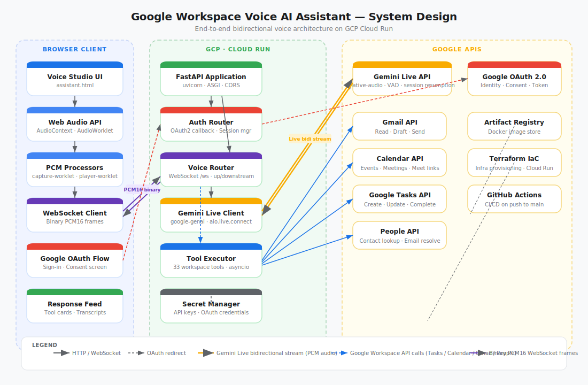

# Google Workspace Voice AI Assistant

A voice-first AI executive assistant powered by Gemini Live API. Speak naturally to manage your Gmail, Calendar, Tasks, and Contacts — all in real time.



---

## What it does

Say things like:
- *"Give me my daily briefing"*
- *"Draft an email to Ada saying I'll be 10 minutes late"*
- *"Move my 3pm meeting to tomorrow"*
- *"What tasks are due this week?"*

The assistant hears you, calls the right Google Workspace API, and speaks the result back.

---

## Local development

```bash
# 1. Clone and create virtualenv
git clone https://github.com/YOUR_USERNAME/workspace-agent.git
cd workspace-agent
python3 -m venv .venv && source .venv/bin/activate
pip install -r requirements.txt

# 2. Add credentials (see .env.example)
cp .env.example .env
# fill in GEMINI_API_KEY, GOOGLE_CLIENT_SECRETS_FILE, etc.

# 3. Run
uvicorn app.main:app --reload
# open http://localhost:8000/ui
```

---

## Deployment — GitHub Actions CI/CD

Every push to `main` automatically builds and deploys to Cloud Run.  
Setup guide: **[DEPLOYMENT_GUIDE.md](DEPLOYMENT_GUIDE.md)**

---

## Project structure

```
workspace-agent/
├── app/
│   ├── api/routers/
│   │   ├── auth.py        # Google OAuth
│   │   ├── voice.py       # WebSocket /ws — Gemini Live bidi stream
│   │   ├── ui.py          # Template serving
│   │   └── health.py      # /health — Cloud Run probe
│   ├── services/
│   │   ├── auth.py        # Session manager
│   │   └── workspace_tools.py
│   ├── static/            # AudioWorklet processors
│   ├── templates/         # index.html, assistant.html
│   ├── tools/             # Gmail, Calendar, Tasks, Contacts, Briefing
│   └── main.py
├── docs/
│   └── system-design.svg
├── .github/workflows/
│   └── deploy.yml         # CI/CD pipeline
├── Dockerfile
├── .env.example
└── DEPLOYMENT_GUIDE.md
```

---

## Capabilities

| Area | Actions |
|---|---|
| **Gmail** | Read unread, draft, review, send with confirmation |
| **Calendar** | Create, find, update, reschedule, delete events |
| **Tasks** | Create, list, complete, set deadlines, delete with confirmation |
| **Contacts** | Resolve names to email addresses |
| **Briefing** | Combined agenda + tasks + email summary |

---

## License

Apache 2.0
